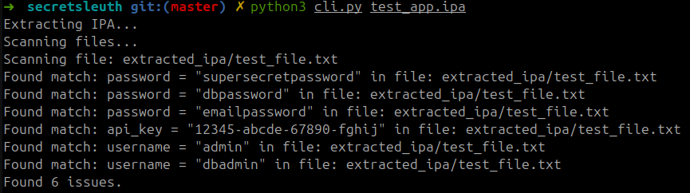

# SecretSleuth 🕵️

SecretSleuth is a mobile application security testing tool designed to scan IPA and APK files for hardcoded secrets such as passwords, API keys, tokens, and usernames.




## Features

- Scans IPA and APK files for hardcoded secrets
- Customizable regex patterns for detecting various types of secrets
- Generates detailed HTML and JSON reports

## Installation

1. **Clone the repository**:
   ```bash
   git clone https://github.com/MasterchiefGalaxy/secretsleuth.git
   ```
   ```
   cd secretsleuth
   ```
   ```
   python3 -m venv venv
   ```
   ```
   source venv/bin/activate
   ```
   ```
   pip install -r requirements.txt
   ```
   ## Usage

   ```
   python3 cli.py /path/to/your/file.ipa
   ```
   ```
   python3 cli.py /path/to/your/file.apk
   ```
   ## Report Generation

    --Reports are generated in HTML format as
   ##
   ```
   report.html
   ```
